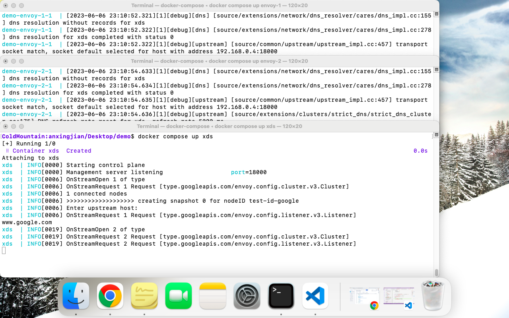

## Preparation

- (Required) Generate TLS certificates and keys:

    ```bash
    cd path/to/demo/certs && ./certs.sh
    ```

- (Optional) To run without containers, `cd` into the `xds` folder and:
    
    ```bash
    go build    # which will generate an executable "envoy-control"
    ```

Keep the `go.mod` and `go.sum` files untouched.

## Run without Docker

Make sure that the listener's address of the bootstrap configuration files for Envoy proxies is set to `127.0.0.1`.

```bash
# Terminal 1: Start Envoy-1
cd path/to/demo/envoy
envoy -c envoy-1/envoy_google.yaml -l debug

# Terminal 2: Start Envoy-2
cd path/to/demo/envoy
envoy -c envoy-2/envoy_wustl.yaml -l debug

# Terminal 3: Start control plane
cd path/to/demo/xds
go run envoy-control
```

Upon receiving a `DiscoveryRequest`, the control plane will ask user to provide an IP address, a cluster name, and a listener's port. Try these two sets of input:

```text
[*] For test-id-google: www.google.com, service_google, 10001
[*] For test-id-wustl: engineering.wustl.edu, service_wustl, 10002
```

And finally,

```bash
# Terminal 4: Access proxy. Replace port number 10001 with the listener's port we give
cd path/to/demo/xds
curl -H "Host: http.domain.com" \
    --resolve http.domain.com:10001:127.0.0.1 \
    --cacert certs/envoy-intermediate-ca.crt \
    https://http.domain.com:10001/
```

## Run with Docker Compose

Make sure that the listener's address of the bootstrap configuration files for Envoy proxies is set to `xds`, the container name associated with the xDS server.

First, inside the `demo` folder, run `docker compose build`. Then, `docker compose up` both `envoy-1` and `envoy-2`.

Run the xDS server:

```bash
docker compose run xds
```

This command should lead us to container `xds`'s shell:

```bash
go run envoy-control
```

The xDS server will make configuration update for an Envoy proxy every 30 seconds.

## Problems

If I comment out the `entrypoint` line inside `docker-compose.yaml`, and run `docker compose up xds`, the control plane seems to be able to receive the first `DiscoveryRequest` and keep spinning:



If I uncomment the `entrypoint` line, and run `go run envoy-control` inside the container `xds`'s shell, the address of `xds` cannot be resolved.

### Update:

The problem is solved when I change the `resource.go` program code to read from a JSON file rather than from standard input.